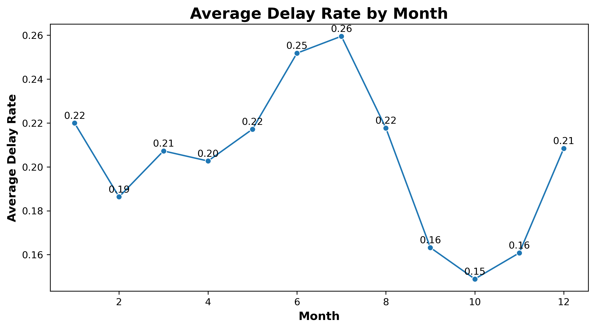
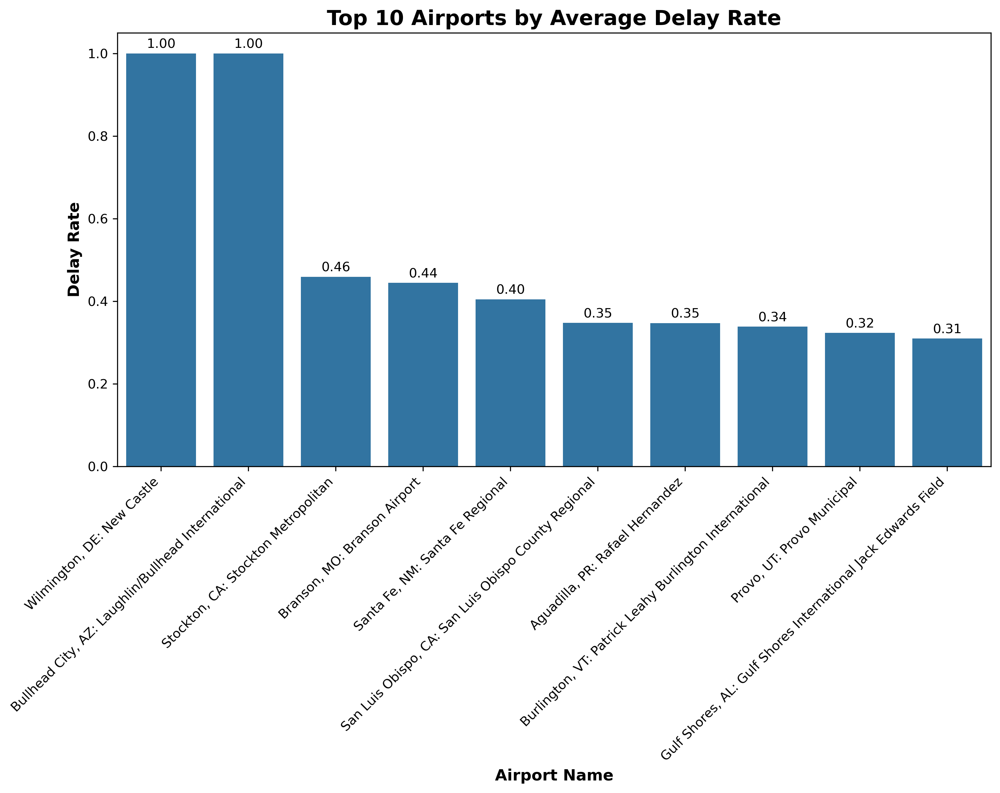
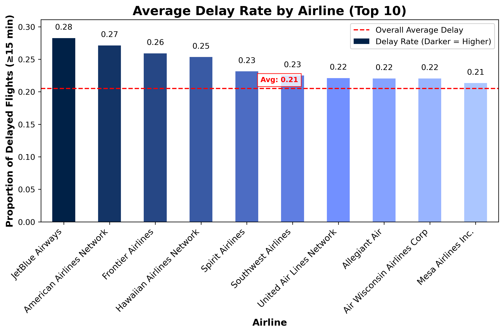
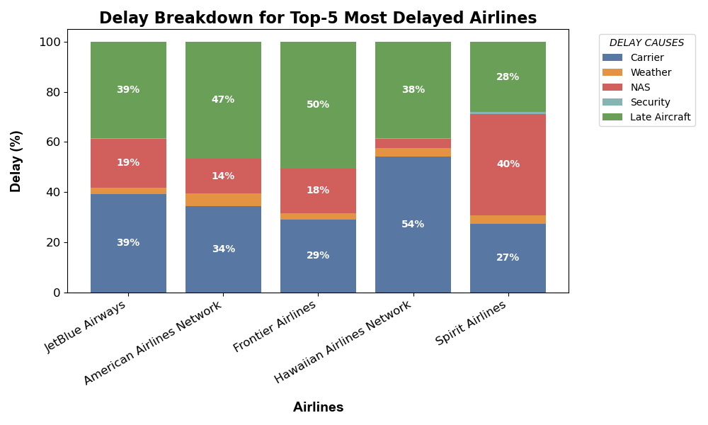

# U.S. Airline Flight Delay Analysis & Prediction

## About This Project

Flight delays are frustrating — sometimes they feel random, sometimes predictable.  
I wanted to understand what actually drives them and whether we can predict which flights are likely to be significantly delayed (15+ minutes).

In this project, I analyze U.S. airline performance data and build a classification model to identify high-risk flights. The idea is simple: use historical patterns, seasonality, airport scale, and airline performance to estimate delay risk.

This project combines SQL data cleaning, Python-based exploratory analysis, machine learning modeling, and model interpretability.

---

## Why I Did This

I wanted to work on a real-world operational dataset — something messy, imperfect, and full of edge cases.

Flight data is a great example:
- Missing values  
- Cancelled and diverted flights  
- Rounding inconsistencies  
- Operational patterns hidden inside aggregated metrics  

I also wanted to practice building a full end-to-end pipeline:
from raw SQL validation all the way to model interpretation using SHAP.

---

## How I Approached the Problem

**Problem type:** Binary classification — predicting whether a flight belongs to a high-delay category (delay_rate ≥ 20%).

**Data preparation:**  
I cleaned and validated the dataset in SQL before exporting it to Python.
- Removed rows with missing arrival counts  
- Handled cases where delays corresponded to cancelled/diverted flights  
- Verified no negative delays  
- Checked consistency between total delays and delay causes  

**Feature engineering:**  
- Cyclical encoding of month (sin/cos) to capture seasonality  
- Log-transformed flight volume (airport scale proxy)  
- Historical average delay rate per carrier  
- Holiday season indicator  

**Encoding & scaling:**  
- One-hot encoding for airport and carrier  
- Standardization for numerical features  

**Train/test split:**  
Stratified split to preserve class balance.

---

## Model Architecture & Evaluation

I tested several models:

| Model               | ROC-AUC |
|---------------------|---------|
| Logistic Regression | 0.74    |
| Random Forest       | 0.77    |
| Gradient Boosting   | 0.78    |
| XGBoost             | 0.80    |

XGBoost performed best, so I selected it as the final model.

Evaluation included:
- Precision, Recall, F1-score  
- ROC curves  
- Confusion matrices  

---

## Key Visuals

### Monthly Delay Trends
Seasonality becomes pretty clear here — some months consistently show higher delay rates.

### Airports with the Highest Average Delays
A few airports stand out with consistently higher delay rates.

### Airlines Ranked by Delay Rate
Not all carriers perform equally when it comes to punctuality.

### Delay Cause Breakdown for Top Delayed Carriers
Breaking down what actually drives delays for the worst-performing airlines.

---

## Results

The final model achieved a ROC-AUC of **0.80**, which shows solid separation between delayed and non-delayed flights.

What stood out most:
- Historical airline performance is highly predictive  
- Larger airports (higher flight volume) tend to have higher delay risk  
- Seasonal patterns matter more than expected  

Using SHAP helped confirm that the model wasn’t just memorizing noise — it was learning meaningful operational patterns.

---

Delay Cause Breakdown for Top Delayed Carriers
Breaking down what actually drives delays for the worst-performing airlines.
